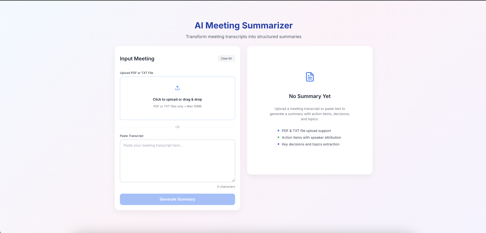
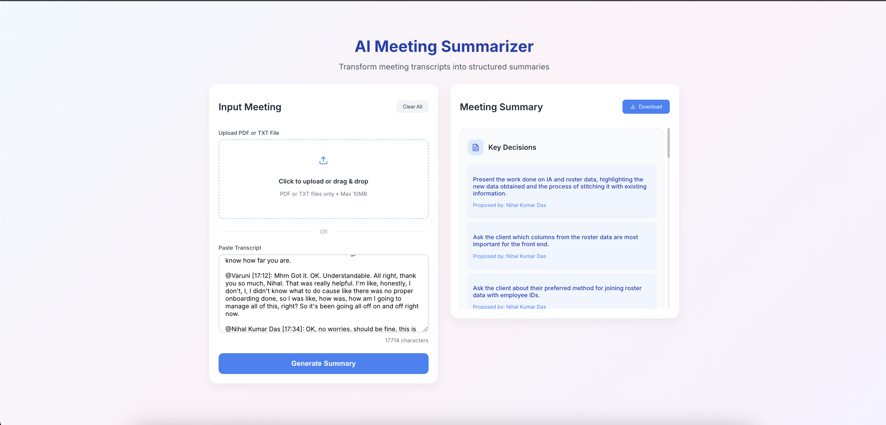

# Meeting Summarizer and Action Item Generator

A project built to learn Agentic AI systems with LangGraph. Implements a three-agent workflow (Classifier, Extractor, Structurer) for meeting summarization to understand multi-agent coordination and structured output generation.

*Main interface for inputting meeting transcripts*

*Structured summary with action items, decisions, and topics*
